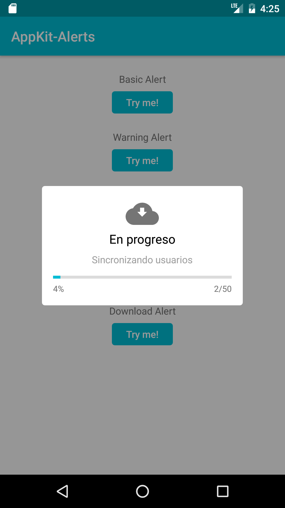

# AppKit-Alerts-Kotlin
Alerts Library for Android

Inspired by JavaScript [SweetAlert](http://t4t5.github.io/sweetalert/)



## Kotlin
---
Kotlin version is [1.0.5-2](https://blog.jetbrains.com/kotlin/2016/11/kotlin-1-0-5-is-here/).

Usage
---------

Show Basic Alert

```kotlin
        Alert("Aviso", "Se ingreso correctamente") {
            confirmButton("OK")
        }.show()
```

Show Warning Alert

```kotlin
        Alert("Aviso", "Seguro que desea eliminarlo", DialogType.Warning) {
            confirmButton("Sí")
        }.show()
```

Show Input Text Alert

```kotlin
        InputTextAlert("Ingresar", "Nombre") {
            confirmButton("OK") { dialog, input ->
                dismiss()
            }
            cancelButton("Cancelar")
        }.show()
```

Show Selector Alert

```kotlin
        val users = listOf("Kevin", "Kelly", "Juan", "Cristina")

        SelectorAlert("Aviso", users) {
            Log.i("Selected", users[it])
        }.show()
```

Show Download Alert

```kotlin
        val dialog = DownloadAlert("En progreso", "Sincronizando usuarios")
        dialog.show()

        //..
        ..//

        dialog.updateProgress(1, 50)

        //..
        ..//

        dialog.updateProgress(50,50)
```